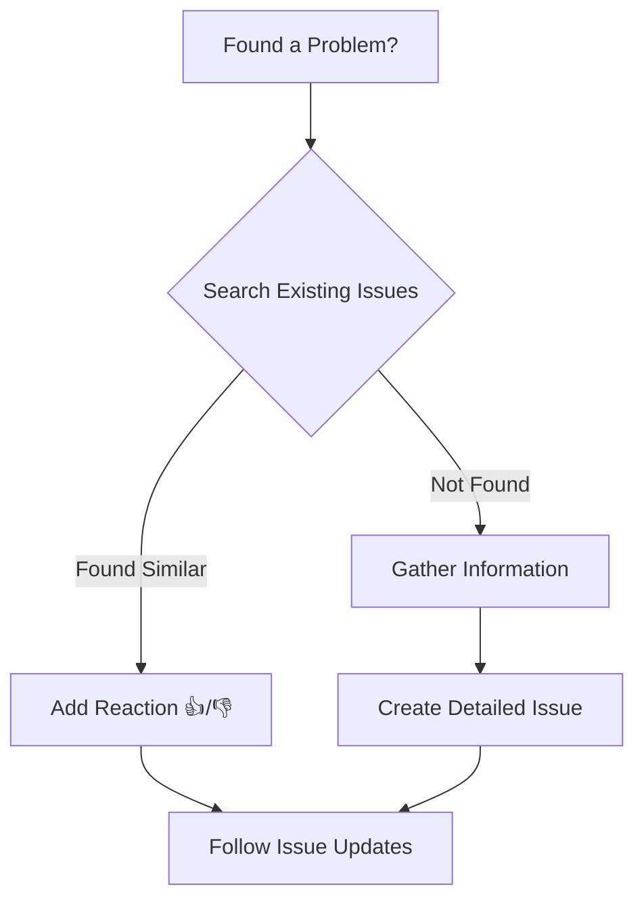
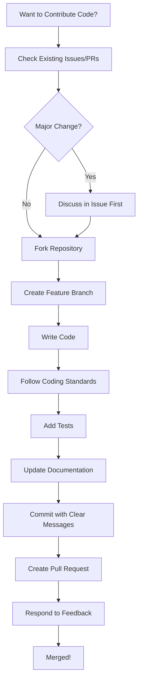

# Contributing

Welcome, and thank you for your interest in contributing to this project!

There are several ways you can contribute, beyond writing code. This document provides an overview of how you can get involved.

## Asking Questions

Have a question? Please use our community channels or discussion forums rather than opening an issue. The active community will be eager to assist you, and your well-worded question will serve as a resource to others.

## Providing Feedback

Your comments and feedback are welcome. Please share your thoughts through our designated feedback channels.

## Reporting Issues

Have you identified a reproducible problem? Do you have a feature request? Here's how to report it effectively:

### Before Creating an Issue

1. **Search existing issues** to see if the problem or feature request has already been filed
2. **Check if it's caused by extensions/plugins** - try reproducing the issue with a clean configuration
3. **Scan popular feature requests** to avoid duplicates

If you find an existing issue, add your reaction (👍/👎) rather than a "+1" comment.

**Important:** File one issue per problem. Do not combine multiple bugs or feature requests in a single issue.

## Contributing Code

If you're interested in writing code to fix issues or add features, please:

## After Submitting

Once submitted, your report will enter our issue tracking workflow. Be prepared to provide additional information if developers cannot reproduce the issue immediately.

## Thank You

Your contributions, large or small, make projects like this possible. Thank you for taking the time to contribute!
